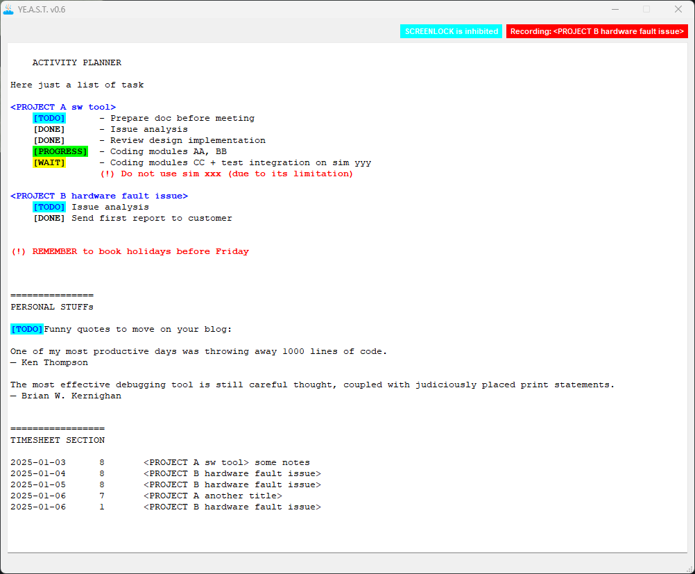

# YEAST

**YE**t
**A**nother
**S**imple
**T**imetracker

> [!WARNING]
> Still work in progress. It seems stable, anyway backup your notes before use it.

## Introduction

The project started on March 2023 for educational purpose. I changed the GUI and re-designed many times, just because I didn't spent enough time to understand user needs and daily workflow.  
I'll probably do some code refactoring ... but at least the requirements are defined.

This is not elegant, well written C++.  
If you are looking for that, it is not the right project.

### The goal

The scope of *YE.A.S.T.* is to measure the time spent on daily task and provide a simple interface to track it, basically a text editor with pre-defined syntax highlighting.

Last three years I just used a plain text file to solve perfectly this scope, *"Live simply"*, but I have to admit that a basic highlighting syntax and few automation can make your life easier.

> Always keep track of time spent on tasks. One day the management will come to you asking for numbers, and reasons ... be prepared!

### Features

+ Based on regular text file (no databases)
+ Tasks and sub-task can be written freely together with notes
+ Sub-tasks can have a STATUS highlighted in different colors for a quick eye-scan-overview
+ Time spent on tasks must be *automatically* tracked and written in the same text file
+ Prefer key shortcuts instead of mouse actions
+ Stripped-back GUI

## User Manual

The editor store all text into a local file named "YEAST.txt".  
I put some notes directly on that file, to explain how things work. Read and then delete all the content to make space to your notes.

### Key shortcuts

+ *CTRL + h* : show help
+ *CTRL + l* : enable/disable auto screen lock (see NOTE-1)
+ *CTRL + t* : toggle sub-tasks status (todo, progress, wait, done)
+ *CTRL + r* : start/stop task time recording
+ *CTRL + s* : save text (see NOTE-2)

## F.A.Q.

**NOTE-1**  
Some company laptop have automatic lock screen protection after N mintes inactive.  
Frankly this *feature* is quite annoying when you are staring at some design document writing notes on paper and a f#@*! login screeen appears. To avoid that I just added a simple workaround triggering periodic OS signals to keep system alive, nothing fancy.  
This feature is disabled at startup.

*Anyway make sure to LOCK your laptop when you are away. Privacy and safety policies are important!*

**NOTE-2**  
There is an autosave timer running in background every 5 minutes.  
The file is also saved automatically when closing the program.

## License

The *YE.A.S.T.* software is provided under the [GNU General Public License Version 3](http://www.gnu.org/licenses/gpl.html).  
Please refer to LICENSE file.
