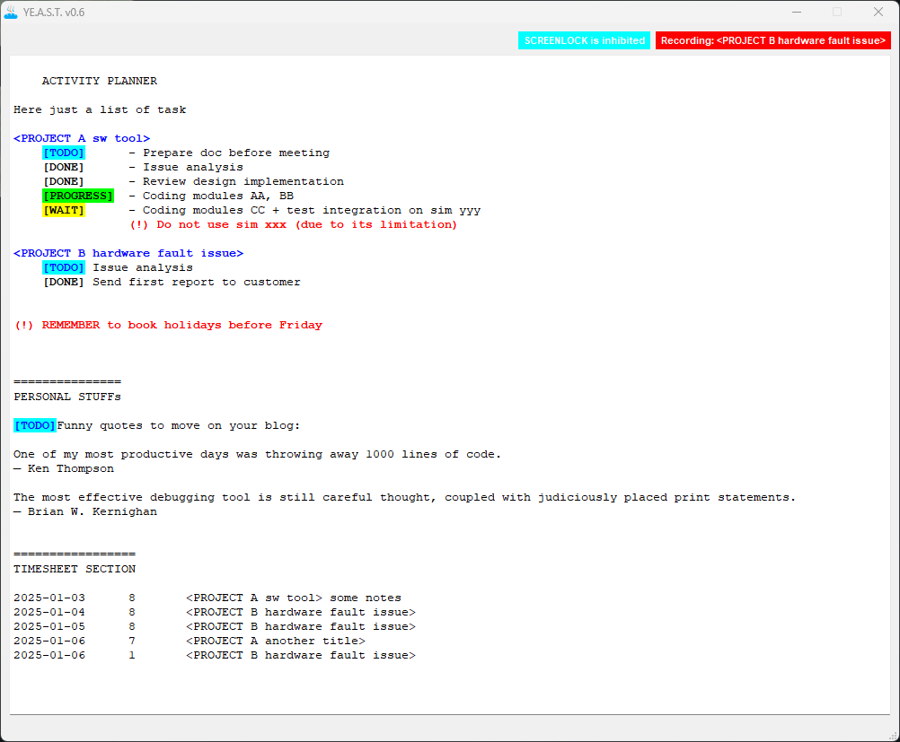

# YEAST

**YE**t
**A**nother
**S**imple
**T**imetracker

> [!WARNING]
> Still work in progress. It seems stable, anyway backup your notes before use it.

## Introduction

The project started on March 2023 for educational purpose. I changed the GUI and re-designed many times, just because I didn't spent enough time to understand user needs and daily workflow.  
I'll probably do some code refactoring ... but at least the requirements are defined.

It is not elegant, well written C++.  
If you are looking for that, this is not the right place.

### The goal

The scope of *YE.A.S.T.* is to track time spent on daily task and provide a simple interface for notes, todo .. basically a text editor with syntax highlighting.

Last three years I just used a plain text file to solve perfectly this scope - *"Live simply"* - but I have to admit that some highlighting and few automations can make your life easier.

> "[..] always keep track of time spent on tasks. One day the management will come to you asking for numbers, and reasons ... be prepared!

### Features

+ No database, just store text into regular .txt file on the same folder of the app
+ Notes can be written freely
+ TASK (tag) provide a visual way to organize your work (but are just text)
+ STATUS (tag) highlighted in different colors for a quick eye-scan-overview of what is going on
+ Time spent on tasks is *automatically* tracked and updated at the bottom of the file (in the *timesheet* area)
+ Stripped-back GUI

## User Manual

The editor store all text into a local file named "YEAST.txt".  
I put some notes directly on that file, to explain how things work. Read and then delete all the content to make space to your notes.

### Key shortcuts

+ *CTRL + h* : show help
+ *CTRL + l* : enable/disable screen lock (see NOTE-1)
+ *CTRL + t* : when cursor is inside a STATUS tag then toggle the value (todo, exec, wait, done)
+ *CTRL + r* : when cursor is inside a TASK tag, start/stop time recording
+ *CTRL + w* : enable/disable word wrap
+ *CTRL + s* : save text (see NOTE-2)

## F.A.Q.

**NOTE-1**  
Most of the company laptop have automatic lock screen protection due to inactivity. This is quite annoying when you are staring at some design document, writing down notes on paper, and a login screeen appears. To avoid that, the app can silently send a periodic OS signals to keep system alive, nothing fancy.  

*Anyway make sure to LOCK your laptop when you are away. Privacy and safety policies are important!*

**NOTE-2**  
File is automatically saved every 5 minutes, or when closing the app.

## License

The *YE.A.S.T.* software is provided under the [GNU General Public License Version 3](http://www.gnu.org/licenses/gpl.html).  
Please refer to LICENSE file.
